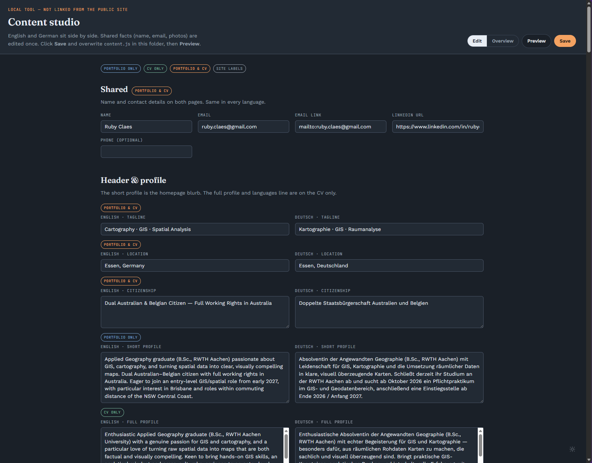

# Ruby Claes Portfolio Site

A bilingual (English / German) portfolio and CV. The live site is [rubyclaes.github.io](https://rubyclaes.github.io/).

To change text, projects, or photos in **VS Code**: **clone the repo → edit in the content studio → commit and push**. GitHub Pages then updates the live site.

---

## 1. First time: get a copy on your computer

1. Install [Git](https://git-scm.com/download/win) (accept the defaults) and [Visual Studio Code](https://code.visualstudio.com/).
2. In VS Code, sign in to GitHub (bottom-left accounts icon, or **Sign in to Sync Settings**).
3. Open the Command Palette: `Ctrl+Shift+P`.
4. Run **Git: Clone**.
5. Paste `https://github.com/rubyclaes/rubyclaes.github.io.git` and press Enter.
6. Choose a folder on your computer, then click **Open** when VS Code asks to open the cloned repository.

You only do this once. After that, use **File → Open Folder…** and pick `rubyclaes.github.io`.

---

## 2. Edit the content

1. Pull the latest site first (see step 3) so you are not editing an old copy.
2. In VS Code’s file list, right-click `editor.html` → **Reveal in File Explorer**, then open that file in **Chrome or Edge**.  
   (This page is a private editing tool. It is not linked from the public site.)



3. Edit English and German side by side. Coloured tags show whether a field appears on the **Portfolio**, the **CV**, or both.
4. Click **Save**. The first time, the browser may ask which file to use — choose the `content.js` already in this folder.
5. To check how it looks, open `index.html` the same way (double-click it) and refresh after you save.

If Save offers a downloaded file instead, drag it into the project folder in VS Code and replace the existing `content.js`.

To add a project photo: copy the file into `images/` in VS Code’s explorer, then set **Image path** on the project (for example `images/my-map.jpg`). Prefer a 4:3 image (e.g. 1200×900). Cards crop tall or wide photos.

---

## 3. Publish to the live site

Always pull before you start, so you do not overwrite newer work on GitHub.

In VS Code, open **Source Control** (the branch icon in the left sidebar, or `Ctrl+Shift+G`):

1. Click **⋯** (More Actions) → **Pull**, so your copy matches GitHub.
2. After you save, `content.js` (and any new images) should appear under **Changes**.
3. Click **+** next to **Changes** to stage them.
4. Type a short message, e.g. `Update portfolio profile`.
5. Click **Commit**.
6. Click **Sync Changes** (or **Push**) to send the update to GitHub.

The live site updates in about 30–90 seconds: [https://rubyclaes.github.io/](https://rubyclaes.github.io/). If you still see the old version, hard-refresh with `Ctrl+F5`.

---

## Language

The globe control switches **English** / **Deutsch** on the whole site, including the CV PDF.

- English is Australian English; German is written for a DACH reader (not the Australia move story).
- The visitor’s language and light/dark choice are remembered in the browser.
- First visit: German if the browser or timezone looks German-speaking (Germany, Austria, Switzerland, Liechtenstein); otherwise English.

---

## CV PDF

Open the CV page, pick English or Deutsch, then **Download**. That uses the browser print dialog to save a PDF of the language on screen.

---

## Project images

- Folder: `images/`
- Path in the editor: `images/your-file-name.jpg`
- Ratio: 4:3. The card uses cover crop.
- Names: lowercase with hyphens, e.g. `flood-risk-brisbane-2026.jpg`
- Formats: `.jpg`, `.jpeg`, `.png`, `.webp`

A wrong path shows an “Image not found” placeholder, not a broken layout. `images/Editor.png` is the content-studio screenshot in this README, not a project card.

---

## Reference (you can skip this)

```
.
|- index.html          Portfolio page
|- cv.html             Full CV
|- editor.html         Content studio (local only)
|- content.js          All editable text — this is what Save updates
|- symbols.js          Skill legend icons
|- script.js / theme.js / styles.css
|- images/             Project photos
|- icons/              Favicons
```

You can still edit `content.js` by hand in VS Code. Translated fields look like `{ en: "English", de: "Deutsch" }`. Keep the quotes and commas valid.
